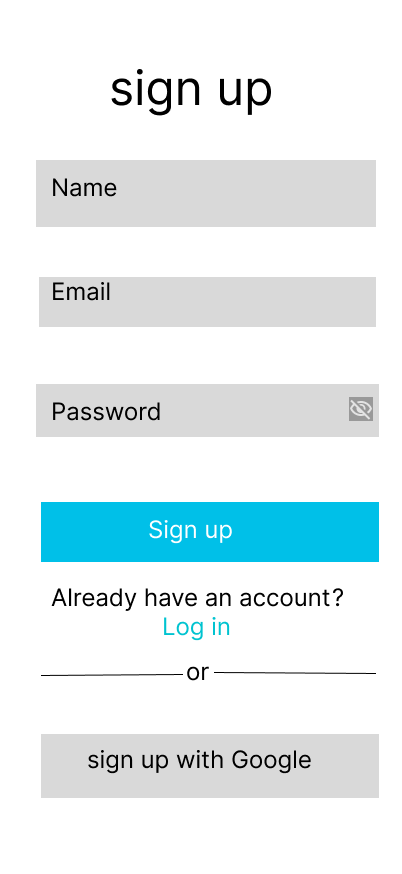
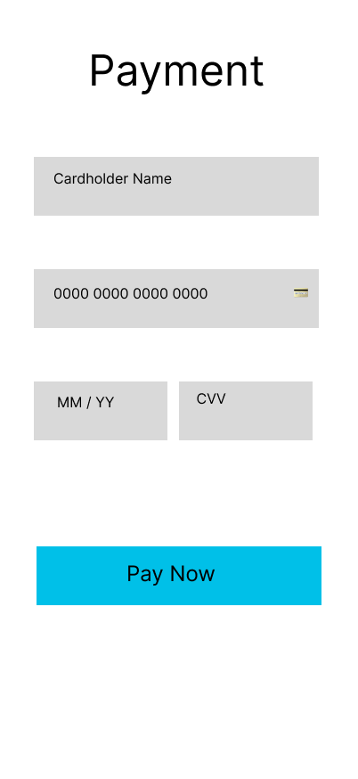

# CSEC ASTU Dev Summer Program 2026 — UI/UX Design Track

Repository to document my progress, daily challenges, and foundational learning throughout the self-directed summer program.

## 📈 Phase 1: Design Foundations (Weeks 1-3)

### 🎥 Video Resource Logs & Key Takeaways

I have fully reviewed the three required foundational video resources from the track spreadsheet:

1. **The Principles of Design | FREE COURSE (Envato Tuts+)**
   * **Contrast & Emphasis:** Learned how to leverage stark differences in color weight and size to draw a user's eye to primary focal points (like the primary CTA button).
   * **Repetition:** Understood how repeating shapes, text casing, and standard spacing creates harmony, professional consistency, and strong brand alignment.
   * **Whitespace:** Mastered using negative space to give design elements breathing room, preventing the user interface from looking cluttered.

2. **UI/UX Explained In 8 Minutes (Simplilearn)**
   * **UI vs. UX:** UI is the presentation, layout, and visual flavor; UX is the strategy, flow, and psychological feeling of the product.
   * **The Product Life Cycle:** Learned the chronological transition from User Research ➡️ Wireframing ➡️ Visual Design ➡️ Information Architecture ➡️ Usability Testing.

3. **Figma Wireframe Tutorial for Beginners (Aliena Cai)**
   * **The Golden Rule:** *“Don’t paint the walls while laying the bricks.”* Focused on building layout structures using grayscale frames before thinking about complex styling.
   * **Industry Standards:** Kept interactive mobile touch targets at a minimum height of 48px for perfect thumb-tapping accessibility.

---

### 🎨 Daily UI Challenges

#### Daily UI #001: Sign-Up Screen
* **Concept:** A minimalist app account creation layout.
* **Design Strategy:** Applied clean vertical hierarchy, standardized form element boxes to 48px heights, and fixed icon alignment to maximize usability based on video feedback.

---

#### Daily UI #002: Credit Card Checkout
* **Concept:** A secure checkout form integrated into the initial application user flow.
* **Design Strategy:** Applied consistent button accents, standardized text heights, and clean layout symmetry to lower user cognitive load during checkout.

